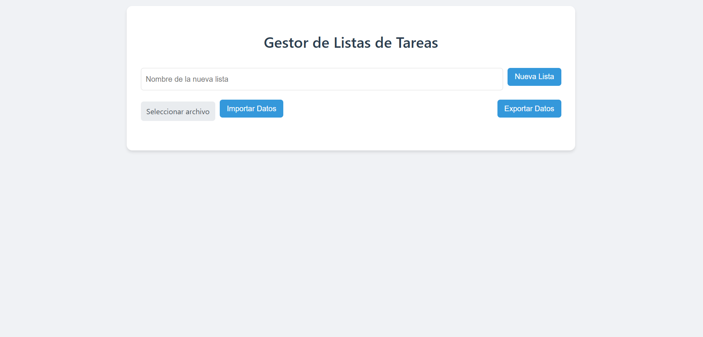
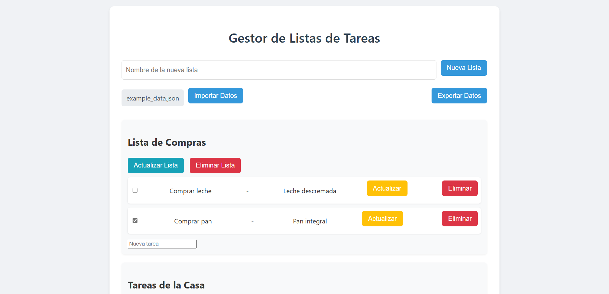

# Gestor de Tareas

Este proyecto es una aplicación web para gestionar tareas, desarrollada con FastAPI y PostgreSQL. Permite crear, actualizar, eliminar e importar/exportar listas de tareas y sus tareas asociadas.

## Características

- **Gestión de Listas**: Crear, actualizar y eliminar listas de tareas.
- **Gestión de Tareas**: Añadir, actualizar y eliminar tareas dentro de las listas.
- **Importación/Exportación**: Importar y exportar datos de listas y tareas en formato JSON.
- **Interfaz de Usuario**: Interfaz web sencilla y fácil de usar.

## Tecnologías Utilizadas

- **Backend**: FastAPI
- **Base de Datos**: PostgreSQL
- **ORM**: SQLAlchemy
- **Frontend**: HTML, CSS, JavaScript
- **Plantillas**: Jinja2

## Requisitos Previos

- Python 3.11+
- PostgreSQL

## Instalación

1. **Clonar el repositorio**:
   ```bash
   git clone https://github.com/tu_usuario/tu_repositorio.git
   cd tu_repositorio
   ```

2. **Configurar el entorno virtual**:
   ```bash
   python -m venv env
   source env/bin/activate  # En Windows usa `env\Scripts\activate`
   ```

3. **Instalar dependencias**:
   ```bash
   pip install -r requirements.txt
   ```

4. **Configurar la base de datos**:
   - Asegúrate de que PostgreSQL esté instalado y ejecutándose.
   - Crea una base de datos llamada `task_list`.
   - Actualiza la URL de la base de datos en `database.py` si es necesario.

5. **Iniciar la aplicación**:
   ```bash
   uvicorn main:app --reload
   ```

## Uso

- Accede a la aplicación en `http://localhost:8000`.
- Usa la interfaz para gestionar tus listas y tareas.
- Importa o exporta datos desde la sección correspondiente.
- La documentación de los endpoints está disponible en `http://localhost:8000/docs` con Swagger.

## Imágenes del Frontend

Aquí puedes incluir capturas de pantalla del frontend y su funcionamiento. Asegúrate de que las imágenes estén en un directorio accesible, como `img/`, y enlázalas aquí.


*Descripción de la vista principal.*


*Descripción de la gestión de tareas.*

## Documentación de Endpoints

La documentación completa de los endpoints está disponible en `http://localhost:8000/docs` a través de Swagger.

### Listas

- **GET /lists**: Obtiene todas las listas de tareas.
- **POST /lists**: Crea una nueva lista de tareas.
- **PUT /lists/{list_id}**: Actualiza una lista de tareas existente.
- **DELETE /lists/{list_id}**: Elimina una lista de tareas.

### Tareas

- **GET /tasks**: Obtiene todas las tareas.
- **POST /tasks**: Crea una nueva tarea.
- **PUT /tasks/{task_id}**: Actualiza una tarea existente.
- **DELETE /tasks/{task_id}**: Elimina una tarea.

### Archivos

- **POST /import**: Importa datos de listas y tareas desde un archivo JSON.
- **GET /export**: Exporta datos de listas y tareas a un archivo JSON.

## Contribuciones

Las contribuciones son bienvenidas. Por favor, sigue los pasos estándar de GitHub para contribuir.

## Licencia

Este proyecto está bajo la Licencia MIT. Consulta el archivo `LICENSE` para más detalles.